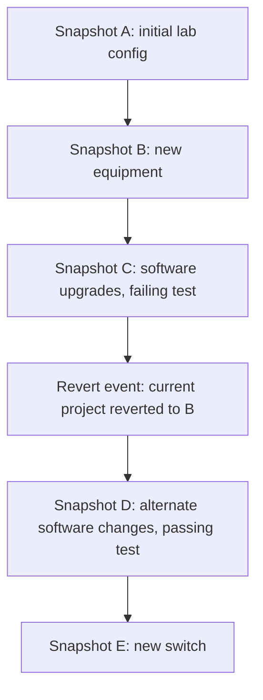
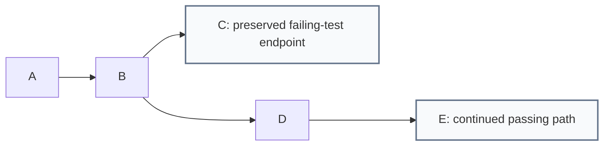
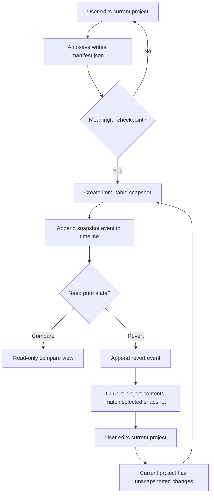
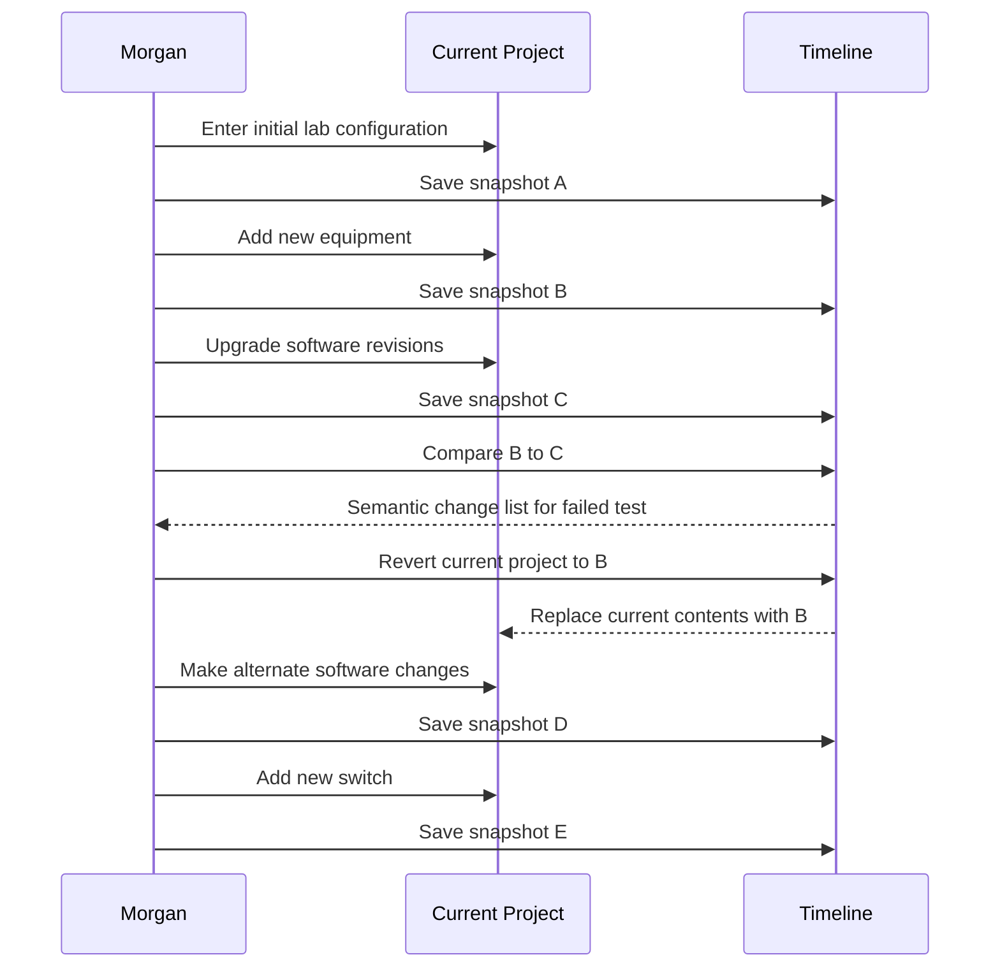

# Manifest Product Usage Model

This document describes how people should understand and use Manifest. It is
intended to settle product semantics before we keep refining UI labels.

The central question is:

> When a user reverts to or views a snapshot, are they editing history, browsing
> history, or changing the current project from history?

## Product Thesis

Manifest is for people managing structured information that changes over time.
The hierarchy is the current model of the thing they care about. Snapshots are
named evidence of what that model looked like at meaningful moments.

Manifest should help users:

- model a structured project without forcing a rigid schema up front
- make changes freely in the current project
- save meaningful points in time as snapshots
- compare meaningful states without reading raw JSON or Git diffs
- recover from a prior state without rewriting the past

## Core Concepts

Manifest should be explained with three product nouns:

1. **Current Project**
2. **Immutable Snapshot Timeline**
3. **Revert Events**

Working-copy status still matters, but it is a UI affordance, not the main
mental model.

### Current Project

The current project is the only editable thing in Manifest. It is what the user
sees in the tree and detail pane during normal use.

The current project is autosaved to `manifest.json`. It can be changed freely.
When the user creates a snapshot, Manifest records the current project state as
an immutable checkpoint.

### Immutable Snapshot Timeline

A snapshot is an immutable named checkpoint in the project timeline. It answers:

- What did this project look like at this important moment?
- What changed between two important moments?
- Can I revert the current project to this moment?

A snapshot is not an editable document. Users should not be able to mutate a
saved snapshot in place.

The timeline is append-only and chronological. If the user creates snapshots A,
B, and C, then reverts to B and creates D, the timeline should still preserve
the full story:

```text
A created
B created
C created
Current project reverted to B
D created
```

C is not removed, hidden, rewritten, or treated as a failed path to clean up.
It remains part of the recorded history.

### Revert Events

Revert changes the current project's contents to match a prior snapshot and
records that action in the timeline.

Revert does not open the snapshot for editing. It does not rewrite the snapshot.
It does not delete snapshots that happened later.

After a revert, the user can edit the current project and create a new snapshot.
That new snapshot is a new event in chronological history, with provenance that
records which snapshot it was based on.

### Content Lineage

The event timeline is linear. Content lineage may fork.

For example:

```text
Event timeline: A, B, C, Revert to B, D, E
Content lineage: A -> B -> C
                    \
                     D -> E
```

Most users should primarily see the event timeline because it matches how they
describe work later: "we upgraded software, the test failed, we reverted to the
previous config, then tried a different change."

Content lineage is still important for provenance. Manifest should record it so
users can answer questions like "was D based on B or C?" without exposing Git
branches as a primary concept.

### Working-Copy Status

Working-copy status answers a smaller, immediate UI question: "Do I have
unsnapshotted changes right now?"

Possible status labels:

| Status | Meaning |
|---|---|
| `Unsnapshotted changes` | The current project has changed since the last known checkpoint or revert. |
| `Current project matches <snapshot>` | The current project currently matches a named snapshot, usually immediately after snapshot creation or revert. |

Avoid making this status the main history model. It should not imply the user is
inside a mutable snapshot or navigating a tree of versions.

### Compare

Compare is read-only. It lets the user inspect differences between two saved
snapshots or, later, between a snapshot and the current project.

While comparing, editing controls should be unavailable or clearly disabled.

## Event Timeline And Lineage

The product should preserve two truths at once:

1. The **event timeline** is chronological and append-only.
2. The **content lineage** records what state each snapshot was based on.

### Event Timeline



### Content Lineage



The first diagram is what most users need most of the time. The second diagram
explains provenance: D was created after C in time, but D's content was based on
B because the current project was reverted to B before D was created.

## Snapshot Lifecycle



## Persona Examples

### 1. Lab Operations Lead

**Context:** Morgan manages lab equipment across rooms, racks, shelves, and
devices. Their team frequently updates firmware, swaps hardware, and needs an
audit trail.

**Why Manifest:** Spreadsheets flatten the structure. Git is too technical.
Manifest gives Morgan a hierarchy plus named checkpoints.

**Typical flow:**

1. Enter the full initial lab configuration.
2. Save snapshot A: `initial-lab-config`.
3. Add new equipment and save snapshot B: `new-equipment-installed`.
4. Run a test.
5. Upgrade software revisions and save snapshot C: `software-upgrade-test-fails`.
6. Compare B to C to understand why the test failed.
7. Revert the current project to B.
8. Make different software changes and save snapshot D: `alternate-software-test-passes`.
9. Add a new switch and save snapshot E: `switch-upgrade`.

**Important semantic:** C remains in the timeline forever. D is created after C
chronologically, but D's content is based on B because Morgan reverted the
current project to B before making the alternate software changes.



### 2. Product or Research Lead

**Context:** Priya maintains a structured research plan: themes, questions,
interviews, findings, and decisions. The plan evolves as evidence comes in.

**Why Manifest:** A document is too linear. A project-management tool is too
process-heavy. Manifest lets Priya structure information and understand how the
research model changed.

**Typical flow:**

1. Create a hierarchy for study areas, participants, and findings.
2. Snapshot `before-customer-interviews`.
3. Add findings and reclassify themes.
4. Snapshot `after-week-1-interviews`.
5. Compare snapshots to see which assumptions changed.
6. Revert only if the current model is no longer useful, then create a new
   snapshot after reworking the plan.

**Important semantic:** Revert is a recorded timeline event. It makes the current
plan look like an earlier plan without changing the earlier snapshot.

### 3. Technical Architect

**Context:** Alex models a system architecture as services, interfaces,
deployment environments, risks, and ownership.

**Why Manifest:** Architecture changes are structural. Alex needs to know what
moved, what was renamed, and which properties changed across proposals.

**Typical flow:**

1. Create the baseline architecture.
2. Snapshot `current-production`.
3. Model a proposed service split in the current project.
4. Snapshot `proposal-service-split`.
5. Compare `current-production` to `proposal-service-split`.
6. If the proposal is rejected, revert the current project to
   `current-production` and try a different proposal.

**Important semantic:** Multiple proposals can branch from the same snapshot as
content lineage, even though Manifest does not expose Git branching as the main
user concept.

### 4. Solo Builder

**Context:** Casey uses Manifest to plan a product: features, screens, user
flows, risks, and release tasks.

**Why Manifest:** Casey wants structure and history without running a full
project-management system.

**Typical flow:**

1. Create a product plan.
2. Snapshot `v1-scope`.
3. Reorganize the tree after user feedback.
4. Snapshot `v1-scope-after-feedback`.
5. Compare the two states to explain scope changes.
6. Revert to `v1-scope` if the new direction was a mistake, then continue editing.

**Important semantic:** Reverting gives Casey an editable recovery point.
Creating another snapshot after that records a new event in time.

## Why Allow Editing After Revert?

Because revert is not "edit a snapshot." Revert makes the current project look
like a snapshot, records that action, and lets the user move forward from a
known-good state.

The safety requirement is provenance: Manifest must preserve the later snapshot
that motivated the revert, such as C in the lab example, and record that the
next snapshot was based on the reverted snapshot, such as D being based on B.

## Revert Is A Recorded Event

Revert should append an event to the timeline:

```text
C created
Current project reverted to B
D created
```

The next snapshot after a revert should record metadata like:

| Field | Meaning |
|---|---|
| `basedOnSnapshotId` | The snapshot whose contents the current project was based on when this snapshot was created. |
| `createdAfterRevertEventId` | Set when a revert event immediately preceded this snapshot's creation; null otherwise. |
| `note` | User-entered context such as "Rolled back from C to retry failed test." |

This keeps the user-facing timeline linear while preserving enough lineage to
answer "what did this state come from?"

### Safety Snapshot Before Revert

Before replacing the current project during revert, Manifest should preserve
unsnapshotted current work automatically. This is not optional in v1.

If the current project has unsnapshotted changes, revert should first create an
automatic safety snapshot or equivalent immutable recovery point, then append
the revert event. Users should never lose current work because they used revert.

Safety captures should not be first-class timeline snapshots by default. They
should live in a separate recovery-points pool, referenced from the revert event
and available when the user asks for recovery details. This keeps the main
snapshot timeline meaningful for audit and storytelling while still providing a
durable escape hatch.

### Revert Notes

Revert notes should be required when reverting past existing later snapshots.
That is the moment future readers need the reason.

Example:

```text
C created: software-upgrade-test-fails
Current project reverted to B
Reason: rolled back from C to retry failed test with alternate software changes
D created: alternate-software-test-passes
```

Revert notes can be optional when reverting only unsnapshotted current work,
because no later saved snapshot is being bypassed.

## What The UI Must Make Clear

The UI should never imply that a user is editing a saved snapshot.

Required affordances:

- The main app should make clear that the user is editing the current project,
  not a selected snapshot.
- Snapshot rows should use action labels like `Revert Current Project to This
  Snapshot`, not `Open` or `Switch`.
- The revert confirmation should say the snapshot will not be changed and later
  snapshots will remain in the timeline.
- Revert should add a visible event to the timeline.
- Creating a snapshot should be phrased as saving the current project, not saving
  the selected historical snapshot.
- Working-copy status can show small immediate state, such as `Unsnapshotted
  changes`, but should not become the main history metaphor.
- Compare mode should be read-only.

## Product Decisions To Confirm

These are the decisions implied by the current model:

| Decision | Proposed answer |
|---|---|
| Can users edit saved snapshots directly? | No. |
| Can users edit after reverting to a snapshot? | Yes, because they are editing the current project. |
| Does revert rewrite history? | No. It changes the current project and appends a revert event. |
| Can users create a new snapshot after revert and edits? | Yes. That records a new point in time with explicit provenance. |
| Is the snapshot timeline linear? | Yes. The event log is chronological and append-only. |
| Is content lineage always linear? | No. Revert-then-edit can fork content lineage, and Manifest should record that honestly. |
| Should revert preserve unsnapshotted current work automatically? | Yes. Create an automatic safety snapshot or equivalent immutable recovery point before replacing the current project. |
| Are automatic safety captures first-class timeline snapshots? | No. Store them as recovery points referenced by revert events, visible on demand. |
| Should revert require a note? | Required when reverting past existing later snapshots; optional when reverting only unsnapshotted current work. |
| Should the product use "snapshot," "checkpoint," or "version"? | Use "snapshot." Avoid "version" because it implies editable or branching versions. |
| Should compare mode allow edits? | No. Compare is read-only. |
| Should Manifest expose Git branches? | Not in v1. The product can record lineage without making users manage branches. |

## Open Product Questions

These should be decided before adding heavier history features:

- Should Manifest support `Compare current project to snapshot` in v1?
- Should users be able to duplicate a snapshot into a separate project later?
- Should snapshot creation require a note/description beyond the name?
- Should Manifest expose content lineage as a separate view, or only as metadata
  inside the chronological timeline?

## Recommended v1 Language

Use:

- `Current Project`
- `Save Snapshot`
- `Save Current Project as Snapshot`
- `Revert Current Project to This Snapshot`
- `Current project matches <snapshot>`
- `Unsnapshotted changes`
- `Snapshot Timeline`
- `Revert Event`
- `Compare snapshots`

Avoid:

- `Switch to snapshot`
- `Open snapshot`
- `Edit snapshot`
- `Current snapshot`
- `Version tree`
- `Branch`

Those phrases imply the user is inside a mutable historical object, which is not
the intended model.
